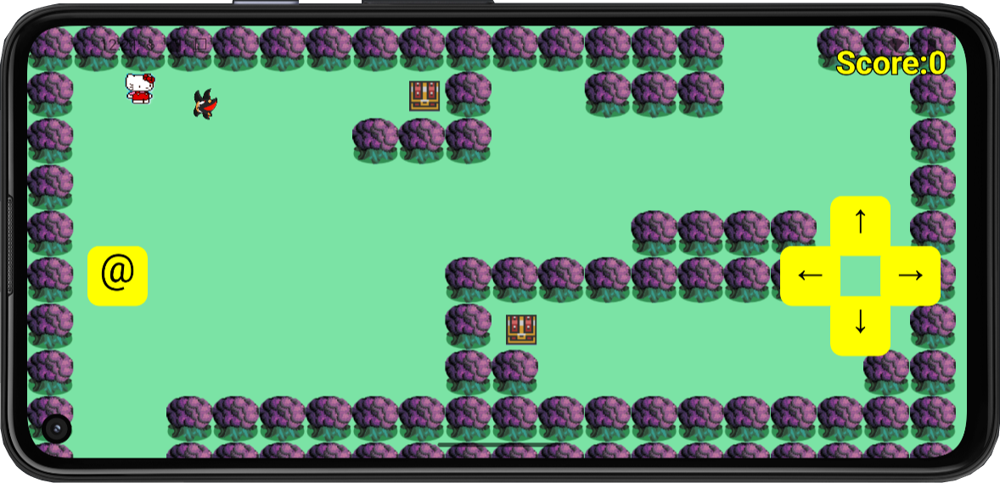

# Hello Kitty Adventure Game

A 2D Android adventure game originally built in Java and later extended to mobile using Android Studio with Kotlin/Gradle integration.

## Features
- Top-down player movement with on-screen controls
- Projectile mechanics (throwing shurikens)
- Enemy interaction
- Collectible characters
- Treasure chests and maze-style levels
- Score tracking

## Tech Stack
- Java
- Android Studio
- Kotlin / Gradle
- Git

## Project Structure
- `java-version/` – Original desktop Java version  
- `android-version/` – Android Studio mobile version  

## About
This project was created as part of coursework and expanded to explore mobile development and game mechanics.

## Disclaimer
This project was created for educational purposes only. Character assets are used for learning and demonstration and are not owned by me.

